# Dossier

**Local-first Agentic Document Intelligence for reviewable, evidence-backed document workflows.**

Dossier is a desktop-first document intelligence platform for teams that process sensitive PDFs, scans, forms, tables, and handwritten documents. It combines agentic OCR, provider routing, validation, bounded repair loops, risk triage, human review, and evidence-backed export so documents can move from intake to business action with control.

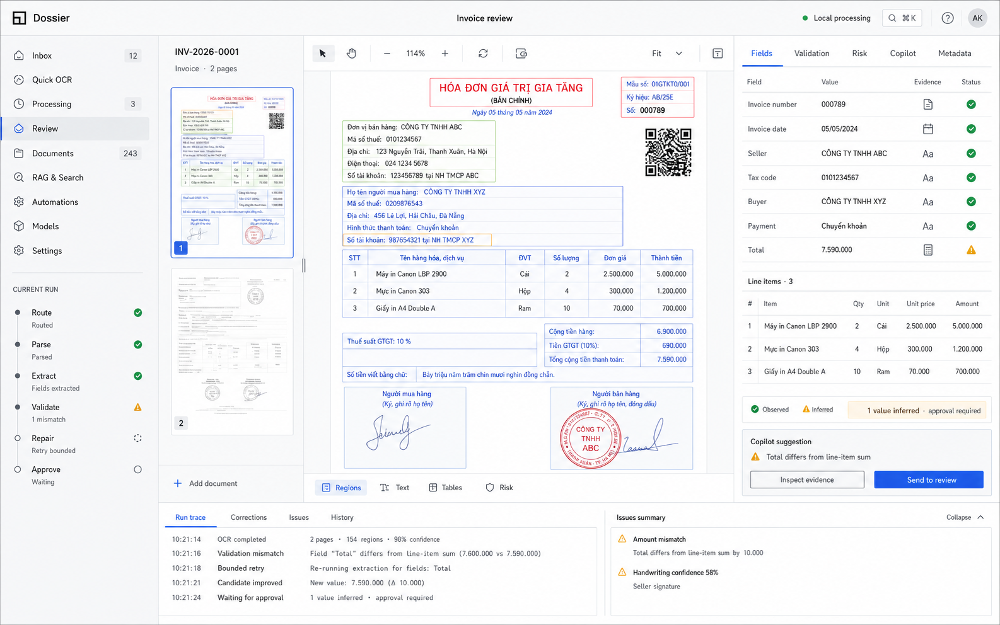

## Why Dossier

Document-heavy teams in finance, healthcare, legal, compliance, and enterprise operations are often caught between manual data entry and black-box OCR or AI services.

Traditional OCR can read characters, but production document workflows need more than text:

- layout, table, and field structure;
- schema-aligned extraction;
- confidence and provenance for every field;
- business-rule validation;
- risk signals such as mismatched totals, missing required fields, or low-confidence values;
- human approval before data moves into downstream systems;
- audit trails for reviews, repairs, revisions, and exports.

Dossier treats OCR as one step inside a governed document workflow. The goal is not to claim that a document is genuine or fake, but to surface the right evidence, uncertainty, and review tasks so operators can make controlled decisions.

## Product Surface

The current desktop product foundation includes Inbox, Quick OCR, Processing Workspace, Documents, Model Registry, and Settings.

| Quick OCR | Processing Workspace |
| --- | --- |
| 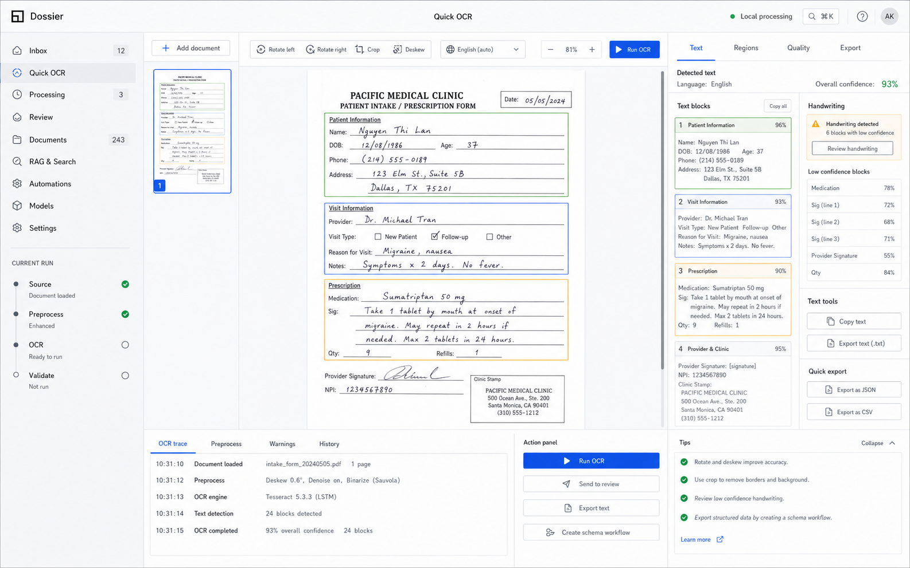 | 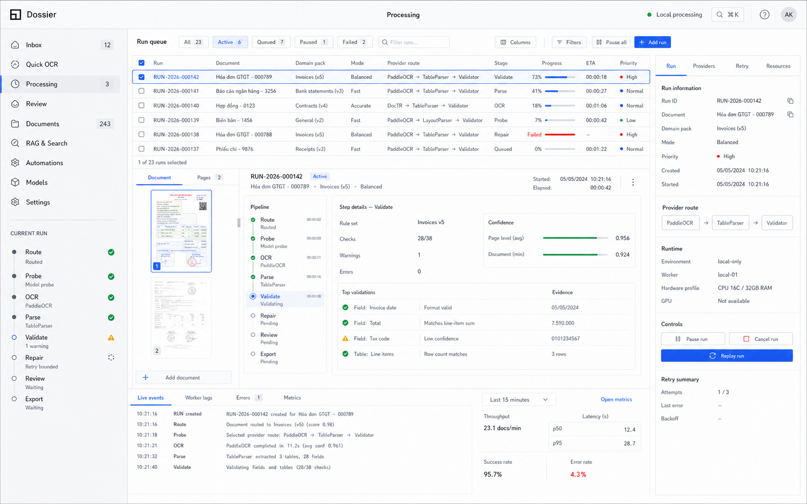 |

| Model Registry | Document Catalog |
| --- | --- |
| 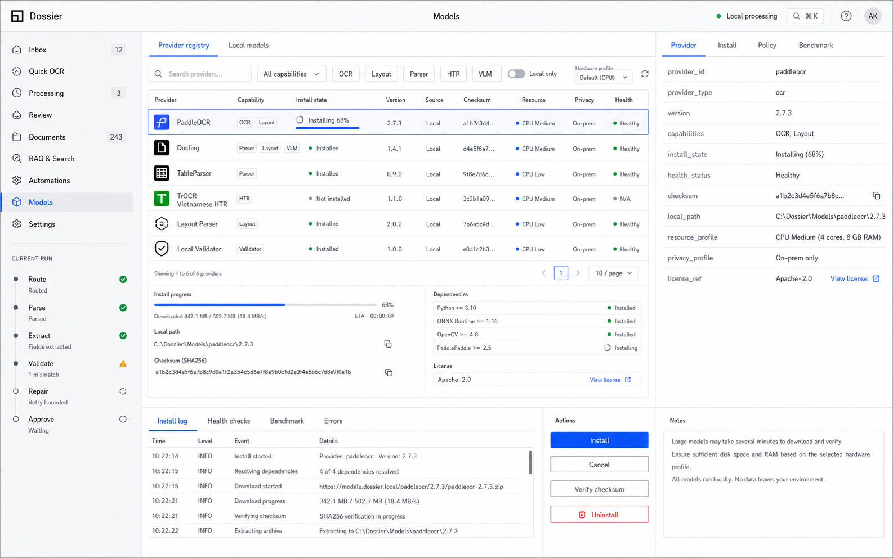 | 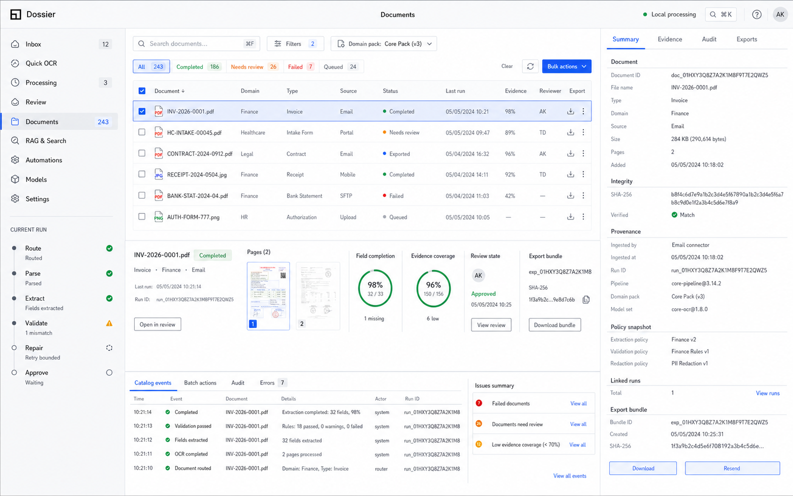 |

## What Dossier Does

- Imports PDFs, scans, and image-based documents into a local-first desktop workspace.
- Runs a Fast Probe step to classify document type, quality, layout, and likely processing path.
- Routes work across OCR, handwriting OCR, layout parsing, table parsing, VLM/LLM providers, and local or cloud models.
- Extracts fields against domain schemas for finance, healthcare, and enterprise operations.
- Validates business logic and required fields before export.
- Runs bounded repair passes when results are incomplete or inconsistent.
- Flags review-worthy risk signals and routes them into human review.
- Preserves evidence, artifacts, confidence, revision history, and approval state.
- Exports JSON, Markdown, and connector-draft artifacts for downstream systems.

## Agentic OCR Workflow

Dossier's agentic OCR workflow is governed orchestration, not unbounded automation. Each step has inputs, outputs, artifacts, stop policies, review gates, and audit events.

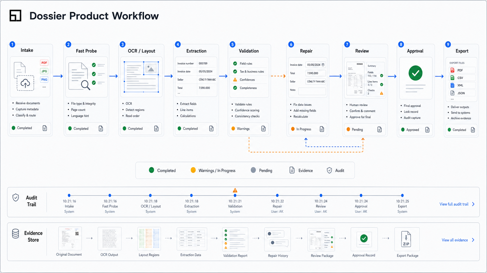

The pipeline is designed around document state:

1. Intake and document registration.
2. Fast Probe for document type, quality, and routing hints.
3. OCR, layout, table, and handwriting provider execution.
4. Schema-aligned field extraction.
5. Validation against domain rules.
6. Bounded repair loop for fixable issues.
7. Risk triage and human review.
8. Approval and controlled export.

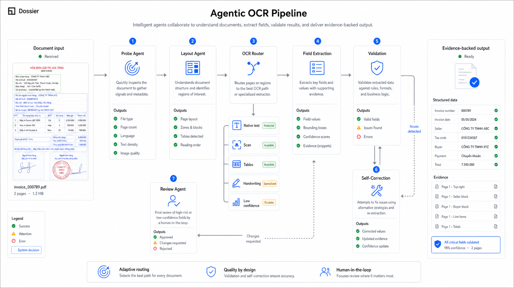

## Evidence-Backed Extraction

Every extracted field is expected to carry more than a final value. Dossier separates observed, normalized, inferred, generated, and human-approved information so reviewers can understand how a result was produced.

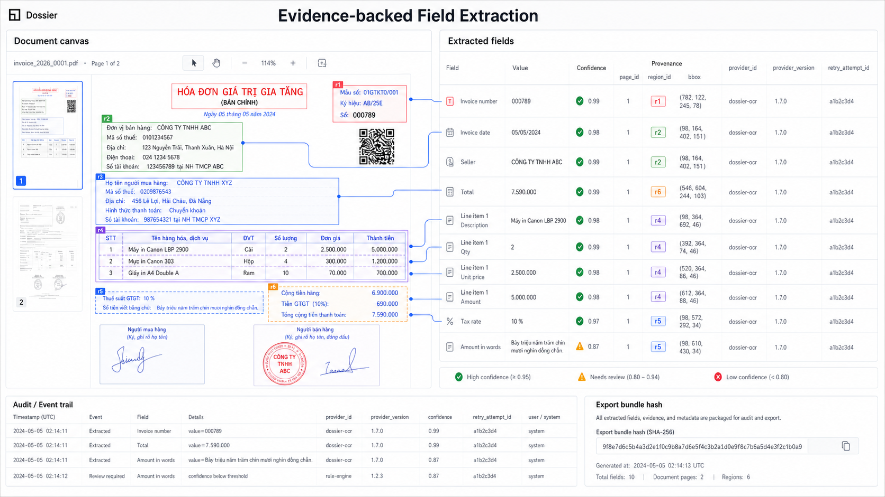

Field-level output can include:

- observed value;
- normalized value;
- confidence score;
- source artifact;
- bounding region or evidence reference;
- validation result;
- repair attempt history;
- reviewer decision;
- export revision.

## Validation, Repair, and Human Review

Dossier does not silently auto-correct consequential data. When validation fails, the system can run a bounded repair pass, create a review task, or block export depending on policy and risk.

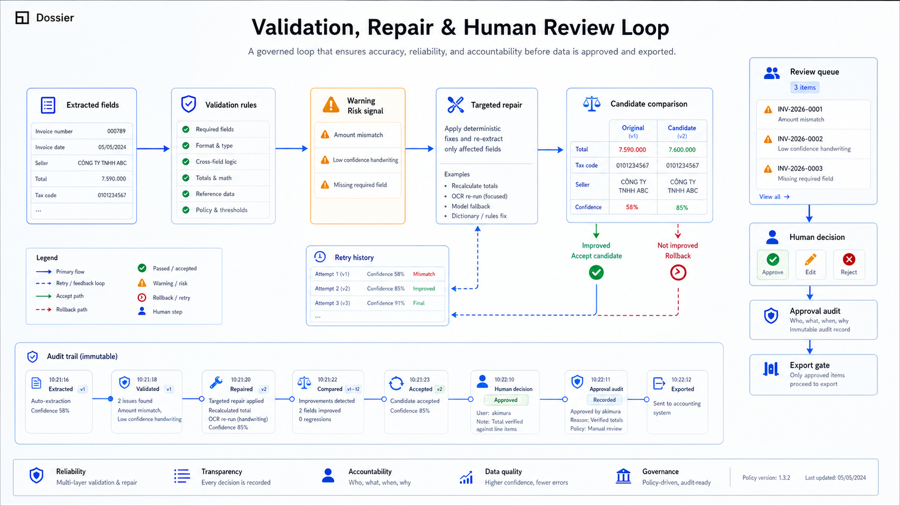

Example review signals include:

- invoice total does not match line items;
- mandatory field is missing;
- handwritten field has low confidence;
- duplicate identifier appears across documents;
- date or amount format is inconsistent;
- extracted value conflicts with domain rules;
- provider outputs disagree.

## Provider Routing

Not every document needs the same model. Dossier is designed around a provider registry and routing layer that can select the right provider based on privacy, cost, latency, document type, confidence, and capability.

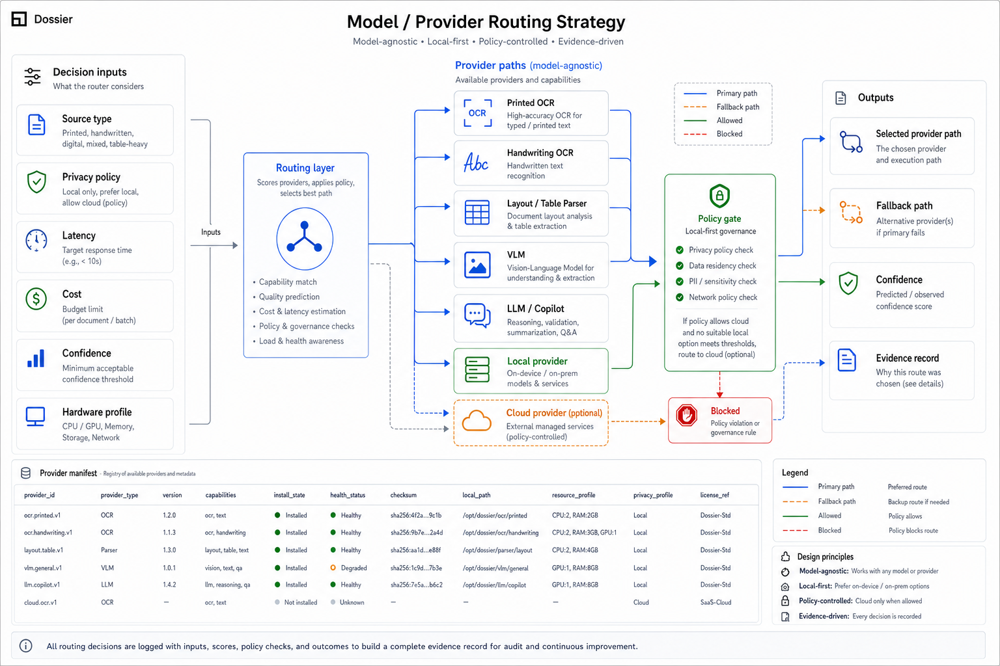

Routing targets can include:

- printed OCR;
- image OCR;
- handwriting OCR;
- layout parsers;
- table parsers;
- structured parsers;
- VLM/LLM providers;
- local models for sensitive data;
- cloud models for high-reasoning tasks.

## Local-First Runtime Architecture

Dossier uses a local-first architecture with a Tauri/React desktop app, Rust desktop kernel, Python local runtime, shared TypeScript contracts, provider SDK, domain packs, sample fixtures, and benchmark tooling.

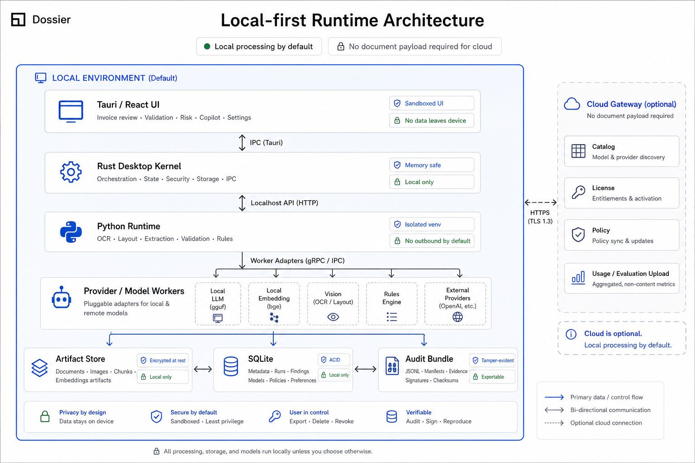

The runtime separates product UI, desktop orchestration, provider execution, pipeline contracts, validation, repair, review, and export so the system can evolve without binding every workflow to a single OCR or LLM vendor.

## Domain Use Cases

Dossier is being shaped around practical document operations rather than generic OCR demos.

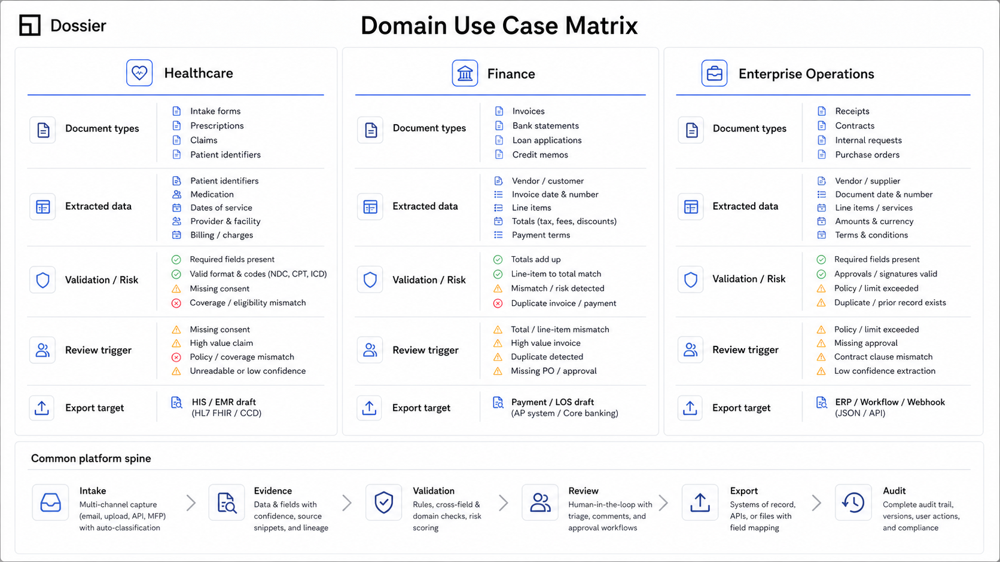

Current demo and fixture directions include:

- finance workflows with invoices, totals, line items, and amount mismatch detection;
- healthcare workflows with forms, records, required fields, and review gates;
- enterprise operations workflows with scanned documents, tables, approvals, and connector drafts;
- handwriting scenarios for fields that need extra confidence handling;
- risk-aware review workflows for documents that should not move straight through automation.

## Current Status

Dossier is an active product prototype and architecture exploration moving toward commercial pilots.

Implemented foundations include:

- Tauri 2 desktop shell with Rust kernel scaffold;
- React desktop workspace for intake, Quick OCR, processing, documents, model registry, and settings;
- Python local runtime for OCR, parse, validation, review, repair, and export flow;
- shared contracts for documents, fields, evidence, events, providers, pipeline state, and review;
- pipeline core with run planning, retry policy, state machine, and review gates;
- provider SDK and provider registry;
- domain packs for healthcare, finance, and enterprise fixtures;
- sample data and benchmark harness;
- JSON, Markdown, and enterprise connector-draft exporters.

Some commercial implementation details, pilot data, and partner-specific workflows may not be fully public in this repository.

## Workspace Layout

- `apps/desktop` - React + Tauri desktop app.
- `apps/desktop/src-tauri` - Rust desktop kernel.
- `apps/local-runtime` - Python local runtime.
- `packages/contracts` - canonical shared contracts.
- `packages/pipeline-core` - run planning, retry policy, state machine, and review gates.
- `packages/provider-sdk` - provider registration and adapter surfaces.
- `packages/domain-packs` - healthcare, finance, and enterprise demo packs.
- `packages/sample-data` - bundled fixtures and demo data.
- `tooling/benchmark` - benchmark harness.
- `tooling/scripts` - Windows PowerShell developer workflow scripts.

## Prerequisites

- Node.js 24+
- pnpm 11+
- Python 3.11+
- Rust / Cargo
- Windows PowerShell

## Install

```powershell
pnpm install
```

## Core Commands

```powershell
pnpm test
pnpm check
pnpm build
Push-Location apps/local-runtime
python -m pytest -q
Pop-Location
```

## Developer Scripts

```powershell
pnpm runtime
pnpm desktop
pnpm desktop:tauri
pnpm benchmark
pnpm demo
pnpm test:all
```

## Local Runtime Notes

The Rust kernel starts the Python runtime on demand in Tauri mode. For direct runtime work:

```powershell
pnpm runtime
```

That script sets:

- `PYTHONPATH=src`
- `DOSSIER_RUNTIME_HOST=127.0.0.1`
- `DOSSIER_RUNTIME_PORT=47821`
- `DOSSIER_STATE_ROOT=<repo>/.dossier/runtime`

## Demo Flow

1. Run `pnpm desktop:tauri`.
2. Import a document from Inbox with `Pick from device` or use a bundled fixture.
3. Run the local pipeline from the workspace.
4. Review queued documents from `Reviewed` or browse imported files from `All Documents`.
5. Approve/export and save the produced artifact to disk.
6. Run `pnpm benchmark` to inspect the baseline fixture metrics.

## License

This repository is currently maintained as a product prototype and technical case study. Licensing and commercial usage terms may change as the product moves toward pilots and deployment.
